# Rider als Software um mit CSharp zu arbeiten.

So wie man texte in Word, OpenOffice oder LibreOffice schreibt, gibt es auch 
für die Programmierung spezielle Software. Um in C# effektive arbeiten zu können 
brauchen wir soll eine Software. Hier wird gezeigt wie man Rider herunterladen und
installieren kann. Soll Software hilf stark weiter und wandelt euren C# Code in
ein ausführbares Program um. 

Rider ist eine Software wie Visual Studio. Kann aber auch auf Linux verwendet werden.
Kann auch natürlich auch für Windows und Mac genutzt werden.

Diese Software ist von Jet Brains entwickelt.

Um Rider zu nutzen, müssen folgende Schritte gemacht werden

- Account bei Jetbrains anlegen.
- Student License für den anlegten Account anfordern mit der Hochschule Email.
- Toolbox von Jetbrains herunterladen.
- Rider über Toolbox installieren.

## Account bei Jet Brains anlegen.

1. Geher zuerst auf diese [Seite](https://www.jetbrains.com/) 
2. Dann klicke das Symbol für Account Management 

Siehe Bild:

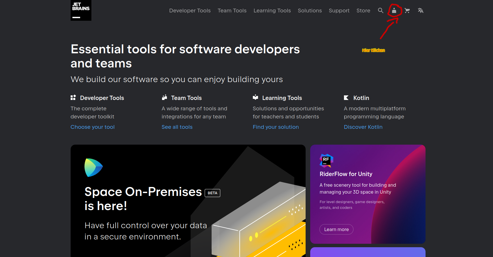

3. Beginne die Registrierung mit Angabe deiner Email:

Klicken auf den Registriernussknopf "Sign Up" wie im Bild mit grün umrandet.

Siehe Bild:

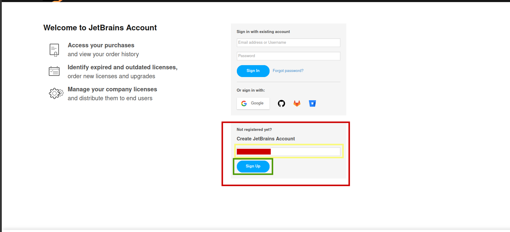

4. Bestätige deine Email Adresse für den Account

Nach dem klicken auf den Registriernussknopf Button "Sign Up" wie im Bild. 
Wird dir auf der Webseite angezeigt, dass du die angeben Email bestätigen musst. 
JetBrains wird dir an deine angeben Email Adresse eine Email zu schicken.
In dieser Email befindet sich ein Link. Klick diesen an. Diese Link bringt dich auf Seite.
Diese Seite ist eine Online Formular wo du Angaben zur deiner Person liefern musst.

Es sollte ungefähr so aussehen

Siehe Bild 
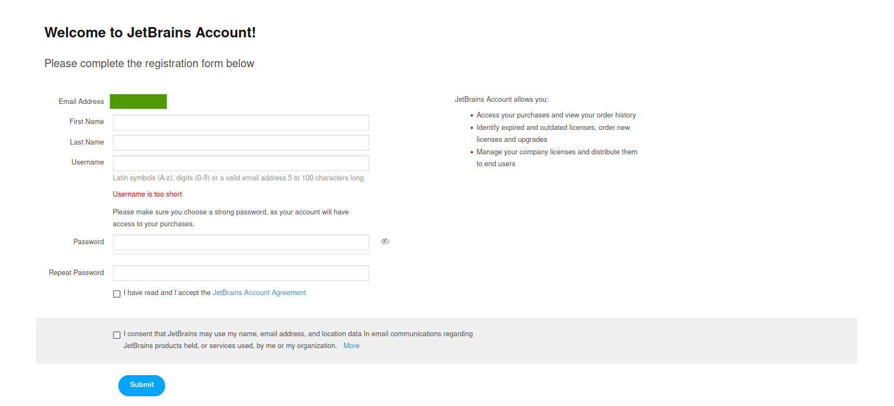 

Nach dem Ausfüllen des Formulars und der Bestätigung der Angaben durch drücken des Absende Knopfs (Submit beim Bild)
Sollte nun solch eine Ansicht ersichtlich sein

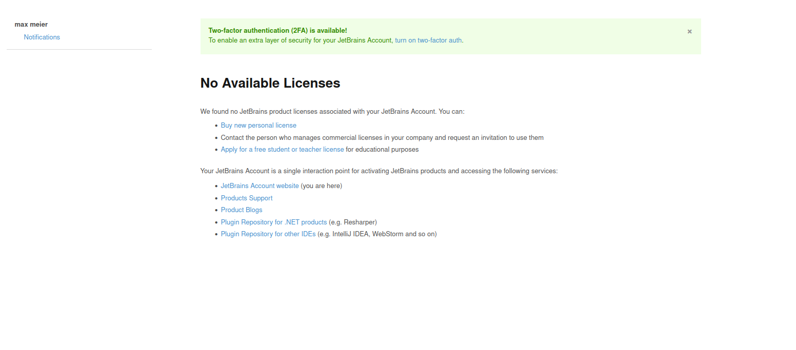 

## Student License anfordern.

Klick auf den Link um die Anforderung einer Studenten License zu starten wie im Bild 
wo die rote Umrandung ist.

Siehe Bild

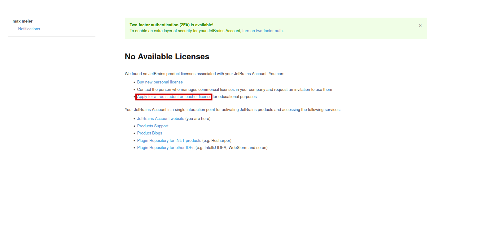

Danach solltest du folgende Ansicht sehen

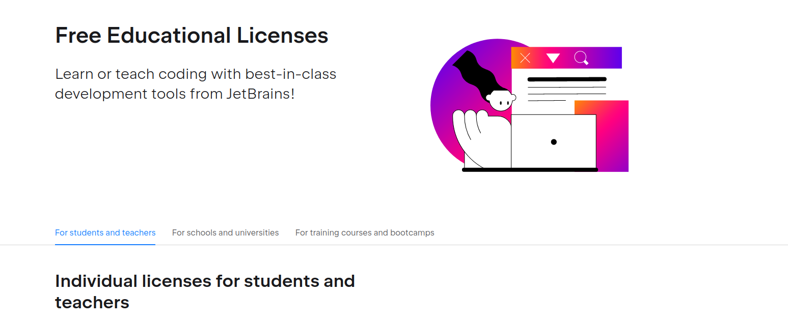

Stelle sicher das der Reiter für Stundend und Lehrer ausgewählt ist.
Im Bild ist das der Reiter "For students und teachers" mit der grünen Umrandung.

Nun scrolle runter und klicke auf den blauen Bewerbung Knopf wie im Bild "Apply now".
Dieser Knopf ist rot umrandet.

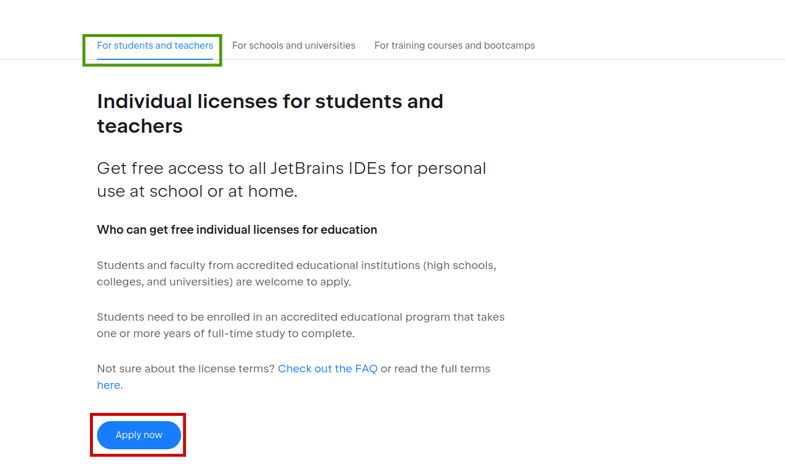

Kommt wieder ein Formular jedoch diesmal für Stunden License.

Sieh Bild

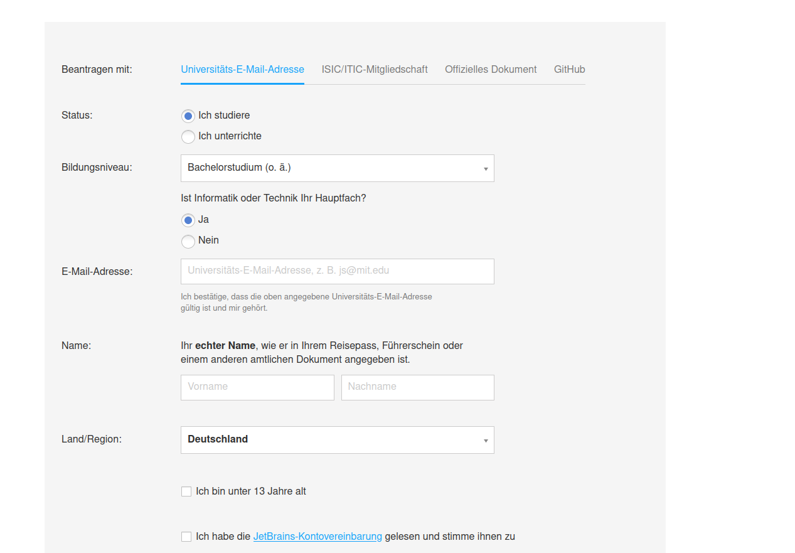

Durch das Ausfüllen gibt man dort dann auch die Email Addresse von der Hochschule.
**Wichtig gäbt die Email Adresse an welche ihr von der Hochschule, Ohm, bekommen habt.**
Eine Email müsste folgendes Muster haben "musterMa11111@th-nuernberg.de".

Scrollt dann runter und klickt auf den blauen Button wie im Bild rot umrandet.

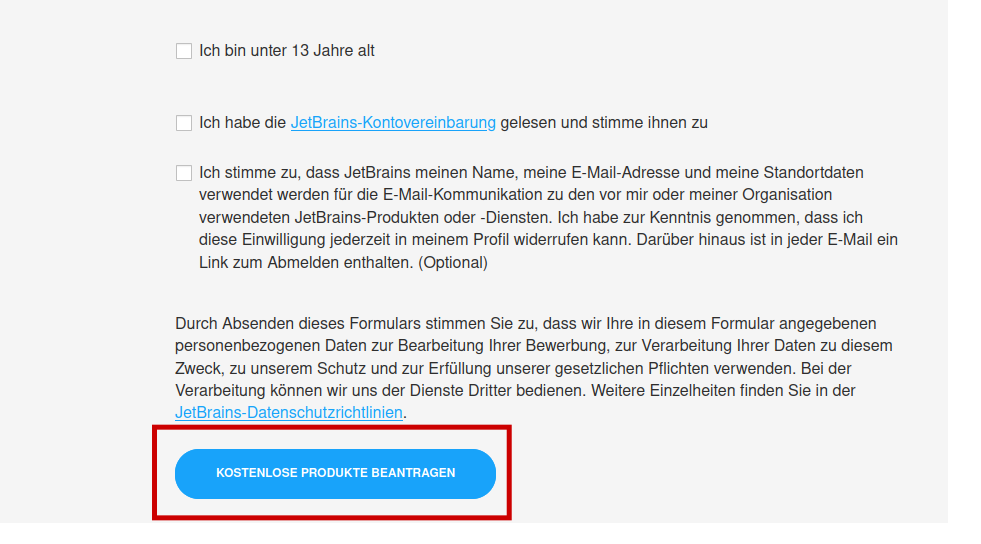

## Verifikation das Stundenden License gewährt wurde.

Wenn ihr es geschafft habt dann müsste folgendes nun sichtbar unter Licenses bei euren Account sein. 

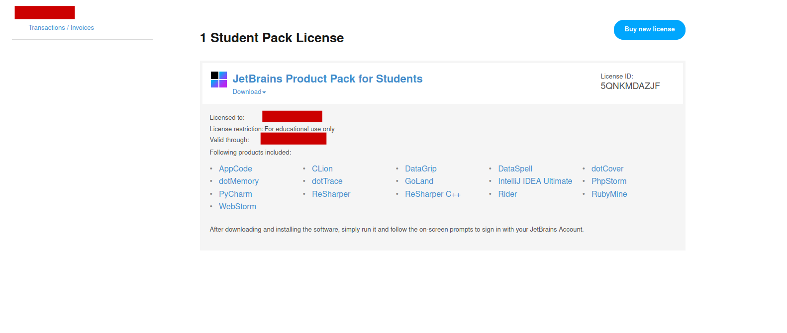

## Toolbox herunterladen.

Man kann zwar Rider auch so herunterladen jedoch gibt eine Software namens Toolbox App.
Diese Software bietet mehr Komfort für Rider. Diese Software updatet auch Rider regelmäßig und stellt auch noch
andere Software von Jetbrains zur Verfügung wie zum Beispiel IntelliJ für Java Programmierung was Studium in den späteren Semester wichtig wird.

Unter folgendem [Link](https://www.jetbrains.com/toolbox-app/) kann die Toolbox App herunterladen werden.

Ladet die .tar.gz Variante herunter für Linux, exe für Windows oder .dmg für Mac.

Sieh Bild 

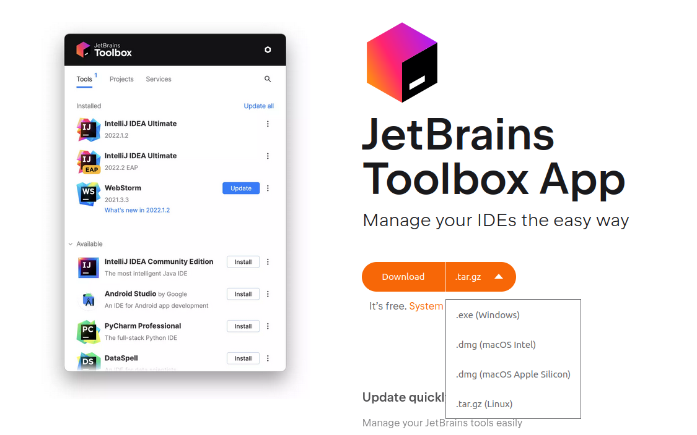

Die .tar.gz Variante für Linux enthält ein AppImage welches man direkt starten kann.

## Rider über Toolbox herunterladen 

Wenn man die Toolbox zum 1. Mal startet kommt folgende Ansicht im unteren Bild.
Klicke auf den blauen Knopf der wie im Bild rot umrandet ist. 

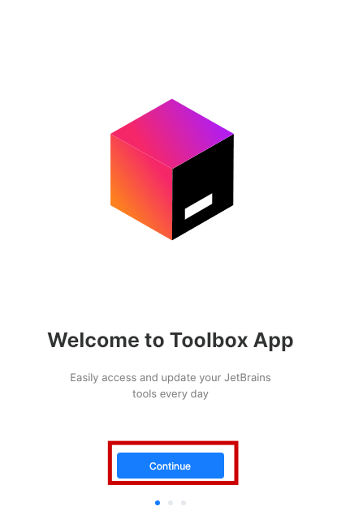

Danach kommt ein Dialog zur Zustimmung der Nutzungsbediengängen.
Bestätigt mit Klick auf den blauen Knopf. 

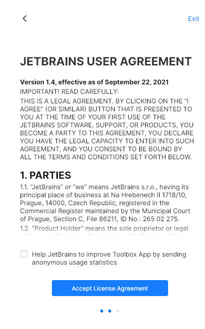

Nun folgt eine Ansicht wo man die Sprache und das Farbschema auswählen kann.
Bester Zeitpunkt auf Dark Theme zu gehen, wenn ihr das wollt.
Klickt auf den blauen Knopf um fortzufahren.

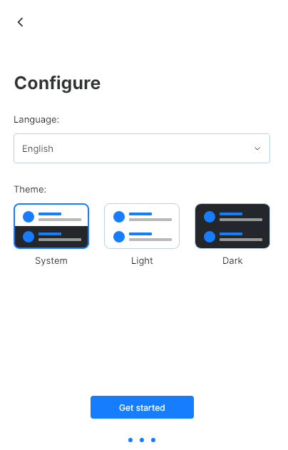

Nun seht ihr die typische Ansicht wie im unteren Bild von Toolbox. Von hier aus
könnt ihr unter dem Tool Reiter, rot umrandet, Entwickler Software für verschiedene Programmiersprachen herunterladen und starten. Klickt bei Rider auf den Download Knopf, grün umrandet. Eventuell müsst ihr nach unten scrollen falls 
ihr Rider noch nicht seht.

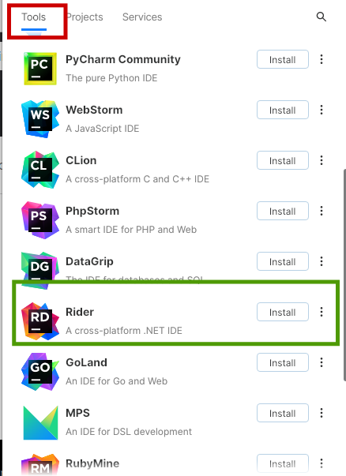

Nach dem Klicken auf den Install Knopf erscheint Rider ganz oben wie untern Bild.
Nun wird die Software herunter geladen und installiert.

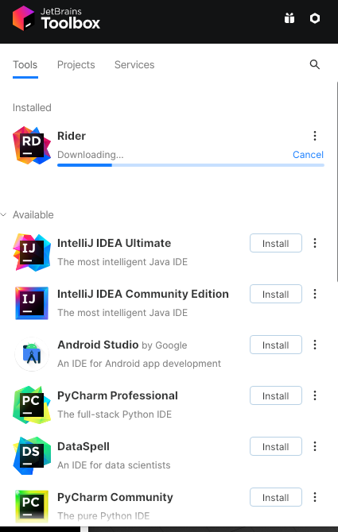

Wenn die Installation fertig ist, dann sollte wie im unten Bild aussehen.
Klick dort direkt drauf, rot umrandet.

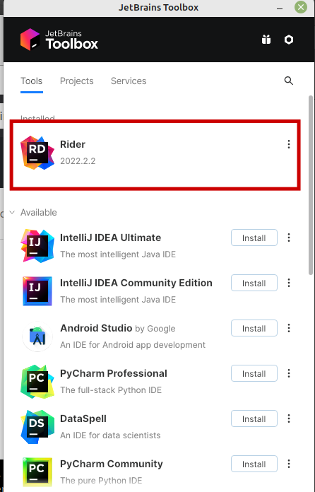

Danach kommt wie unteren Bild ein Pop up. Klickt auf eine der beiden weißen Knöpfe, entweder keine Daten senden oder senden von anonymen Daten.

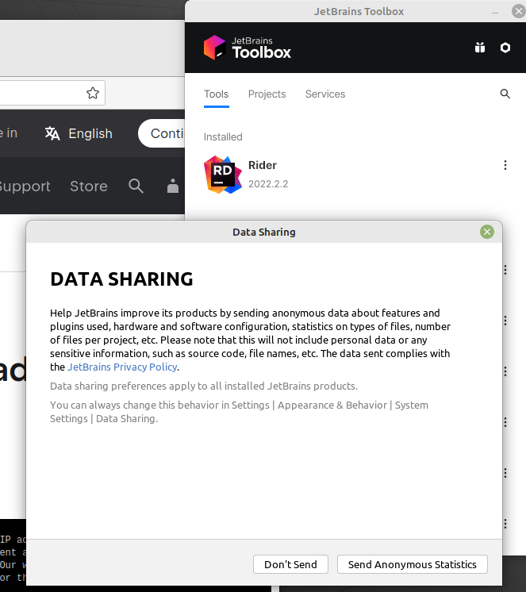

Wie im unteren Bild seht ihr nun folgende Ansicht. Klickt nun auf den Knopf, rot umrandet. Damit kann Rider euren Account bei Jetbrains festellen und eure Studenten Lisene erkennen.

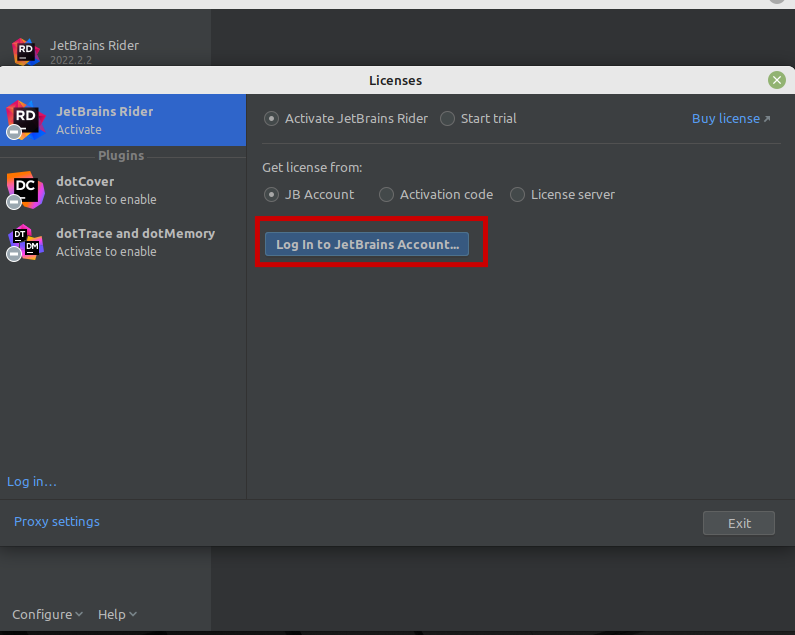

Danach öffnet sich eine Browser Fenster wie im unteren Bild.
Nun gebt deine Login Daten vom Jetbrains Account ein, mit welchen du dich bei
der Jetbrains Webseite registriert hast. Nach Eingeben der Daten, drückt auf den 
blauen Knopf

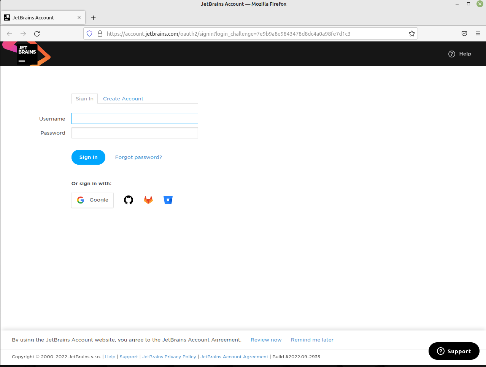

Nun sollte im Browser es so aussehen wie unteren Bild.
Man kann das Fenster jetzt schlissen.

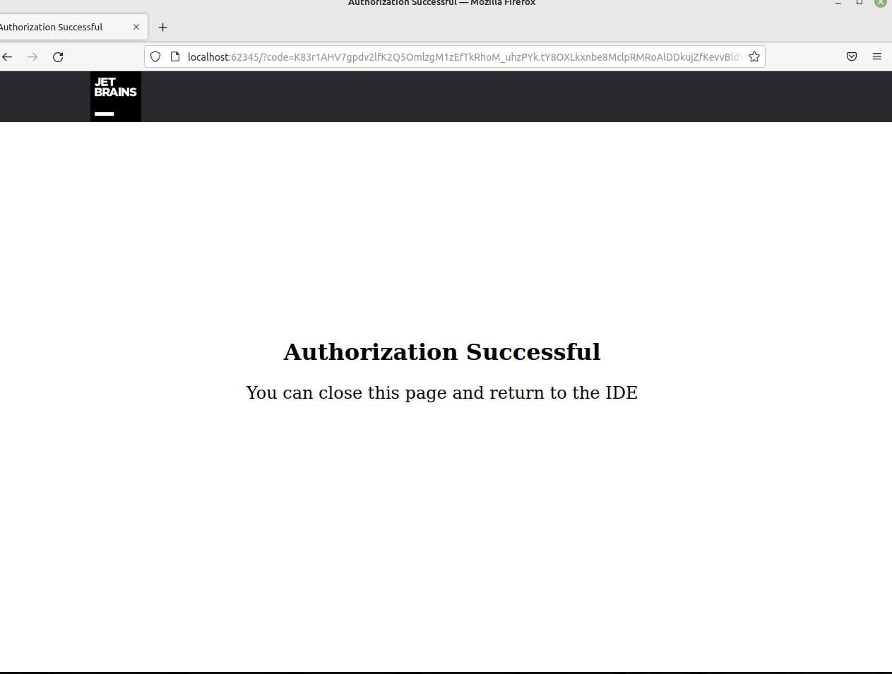

Geht wieder zum offenen Fenster von Rider.
Wie unteren Bild drückt nun auf Knopf, rot umrandet, um den Account an Rider zu binden.

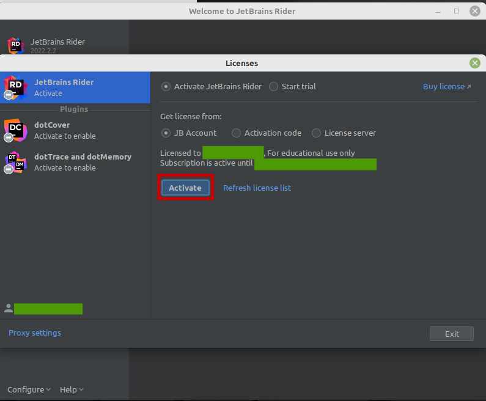

Danach sollte es wieder wie im unteren Bild aussehen.
Klickt nun auf den Knopf Continue, rot umrandet.

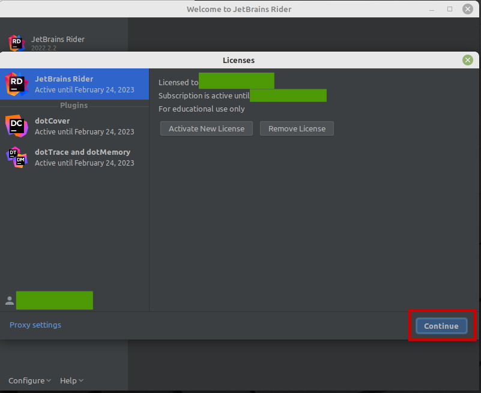

Nun sollte ihr folgende Ansicht haben wie im unteren Bild.
Nun könnt ihr Projekte anlegen.

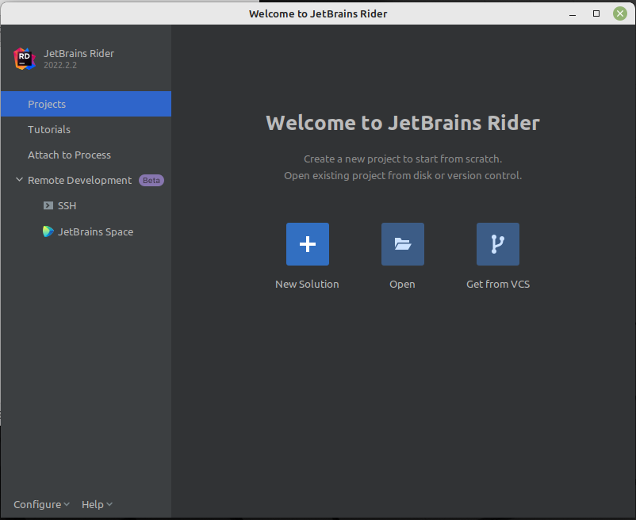

Achtung man muss nun noch die Runtime und Development Umgebung für C# installieren um auch in Rider C# Projekte anzulegen.

Siehe [Setup_Csharp_Linux](../Setup_Csharp_linux.md)
